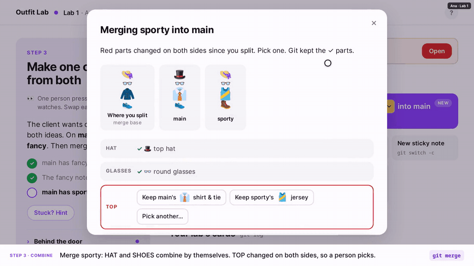
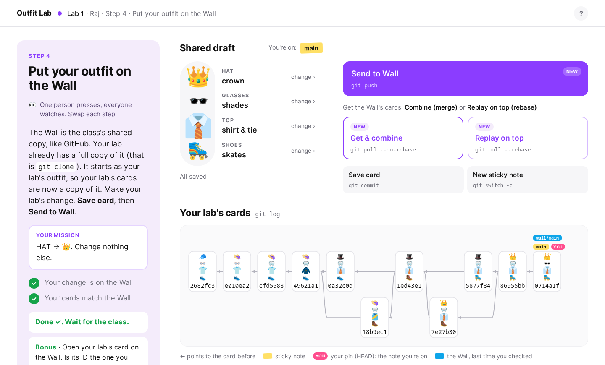
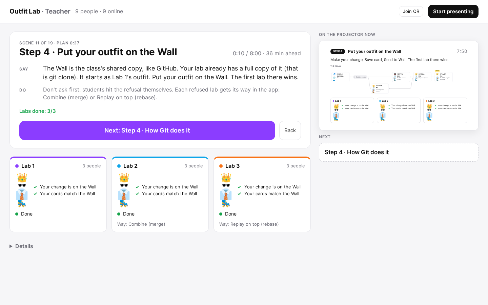
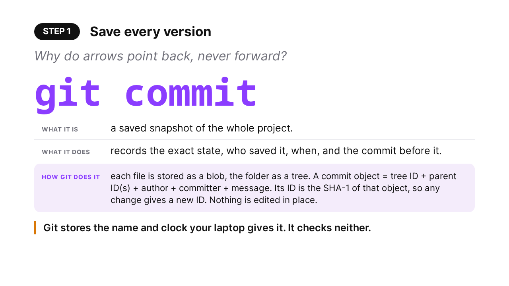

# CS294 · Git Week

Teaching materials for Git week in UC Berkeley CS294 *Modern Programming Tools* (Shubham & Ananya).
**Tuesday: Outfit Lab**, a web app where each lab dresses one character; every save, merge, send and undo runs real Git, and students predict what Git will do before it does. **Thursday: The Humans**, where the class takes a study's own survey, re-checks its rule on its own data, and puts its claims on trial. Same app, and the teacher presses only Next.

## What's covered

### Tuesday · Outfit Lab

80 minutes, 7 steps. Each step: the class hits a problem, fixes it with one Git tool, then sees how Git does it on one technical card per tool. The paper is Just et al., *Switching to Git: the Good, the Bad, and the Ugly*, ISSRE 2016. Its message, for analysts: **flat history is data loss**, against what developers gain from it (easy bisect and revert).

| Step | What happens | Git tools | Paper |
|---|---|---|---|
| 0 Chaos | Everyone edits one shared outfit, live. Nothing is saved. | none yet | |
| 1 Save | Everyone saves a card. Git stores the name and clock your laptop gives it, and checks neither. | `git commit`, `git log`, `git cat-file -p` | §2.1 objects and IDs · §5.6–5.7 clocks and names |
| 2 Two ideas | Pairs build fancy and sporty, each on its own sticky note. | `git switch -c`, `git switch` | §2.1 refs |
| 3 Combine | fancy fast-forwards and its note is deleted. sporty conflicts on TOP; a person picks. | `git merge`, `git branch -d` | §5.1 fast-forward · §3.1 merge commits |
| 4 Share | The Wall is the class's shared copy. The first send wins; refused labs merge or rebase. Each change's path to main, with this class's times. | `git clone`, `git push`, `git pull --no-rebase`, `git pull --rebase` | §5.2 rebase · §6 integration paths, code velocity |
| 5 Undo | The Intern's 🥸 card reaches every lab. A fix card (revert) sends like any card. Moving the note back (reset), then sending, is refused. | `git revert`, `git reset --hard`, `git reflog` | §5.5 revert |
| 6 Clean up | The boss squashes and force-pushes. "Who first added the 🥾 boots?" now fails on the Wall. | squash, `git push --force`, `git gc` | §5.4 squash · §8 loss that cannot be recovered |

### Thursday · The Humans

80 minutes, User Study Day, in the order of the course's User Studies lecture. The paper is Yang et al., *Do Developers Really Know How to Use Git Commands? A Large-Scale Study Using Stack Overflow*, TOSEM 2022. Its authors published their survey form and all 80,370 posts; the class uses both. Its message: **asking is not using.**

| Part | What happens | Paper |
|---|---|---|
| Be the data | Everyone takes the paper's survey, its real questions. | §2.2 the survey |
| 1 The question | The five RQs on one slide. Vote: what kind of study is it? Need-finding. | RQ1–RQ5 |
| 2 The data | Vote: what are Stack Overflow posts? Traces, of asking. The class's survey answers beside the paper's 92, who were found through Stack Overflow. | §2.1, §2.2, Table 7 |
| 3 The analysis | Students label 8 real posts from its data (stuck on the command, need it but can't name it, not about it): the paper's rule counts all three the same. Then they code the paper's Table 8 comments themselves: no method, no agreement reported. | §2.1 Steps 5–6, Table 4, Table 8 |
| 4 Do you believe it? | Groups of about 4 each put one claim on trial: what was measured, and what the data supports. One claim survives as written. | RQ2, RQ4, RQ5, §3.5 |
| 5 Design | Why do people have to ask how to undo? One change to Git, an evaluative question, a measure and one threat, and data that is not a survey. Then what Git 2.23 and Jujutsu did. | §4 implications; §6 "rather than changing the design of Git" |

Every number the paper does not print comes from [`analysis/thursday_numbers.py`](analysis/thursday_numbers.py), which applies the paper's rule to the authors' data. It matches their post counts exactly for 73 of 136 commands, and Table 4's rows within 8%.

## Run it

```bash
cd app
npm install
npm start      # http://localhost:3000; the terminal prints the teacher link
```

Needs Node 22+ and Git 2.45+. **Teachers start with [`lesson/TEACHER_BRIEF.md`](lesson/TEACHER_BRIEF.md).** App guide: [`app/README.md`](app/README.md). Day of: [`lesson/DAY_OF.md`](lesson/DAY_OF.md).

## Host it for class

`cd app && ./host.sh` starts the app and a Cloudflare quick tunnel (no account, no firewall change; it downloads `cloudflared` itself). It prints three links for each day: **Students**, **Teacher** (with the key) and **Projector**. Thursday's are the same with `/thu`. The link works while the machine runs and changes on restart.

- A stable link: `./deploy_cloudrun.sh PROJECT REGION` (Cloud Run, one instance).
- Docker: `docker build -t outfit-lab . && docker run -p 3000:3000 -v outfit-lab-data:/data outfit-lab`.

## Try it alone

Tuesday: on the teacher page, open **Details → Rehearse with bots**. Pick 2–12 bots and a speed (real time, 5× or 20×). The bots join like students and play every step through the student buttons, following their own hints. You press only Next. To see the student side, open the student link in another window and join.

Thursday: open `/thu/admin?key=…`, then `/thu` in two or three private windows as students.

## Demo



The full class run, 4:50: [`demo/DEMO.mp4`](demo/DEMO.mp4) (recorded with the first Tuesday version, before predictions and choices). The teacher console, the projector and two students, with a caption naming each Git tool. Every caption with its frame: [`demo/DEMO_STORYBOARD.pdf`](demo/DEMO_STORYBOARD.pdf).

| Student | Teacher console | Projector |
|---|---|---|
|  |  |  |

## Files

| | |
|---|---|
| [`lesson/TEACHER_BRIEF.md`](lesson/TEACHER_BRIEF.md) | **Start here.** Both days in 10 minutes: every step, what to land, the facts to know, hard questions |
| [`lesson/DAY_OF.md`](lesson/DAY_OF.md) | Day-of checklist: tmux, displays, test join, Reset, export |
| [`lesson/ONE_PAGE.md`](lesson/ONE_PAGE.md) | Both days, one page each: time, scene, the one question |
| [`lesson/tuesday.md`](lesson/tuesday.md) | Tuesday script: Say, Do and Ask for every scene |
| [`lesson/thursday.md`](lesson/thursday.md) | Thursday script: objectives, clock, the verdicts, every number with its source |
| [`lesson/tuesday_paper_notes.md`](lesson/tuesday_paper_notes.md) | The Tuesday paper from the full text, by section |
| [`app/`](app/) | The app. Tuesday: students `/`, teacher `/admin`, projector `/screen`. Thursday: the same under `/thu`. Spec in [`app/SPEC.md`](app/SPEC.md) |
| [`slides/tuesday_app.pptx`](slides/tuesday_app.pptx) | Tuesday's technical cards as a deck, built from the app's text (+ preview PDF) |
| [`slides/thursday_app.pptx`](slides/thursday_app.pptx) | Thursday as a deck, built from the app's text, with the paper's numbers and the model answers (+ preview PDF) |
| [`analysis/thursday_numbers.py`](analysis/thursday_numbers.py) | Recomputes Thursday's numbers from the paper's data and samples the 8 posts |
| [`slides/build/`](slides/build/) | The deck builders |
| [`story/STORY.pdf`](story/STORY.pdf) | Tuesday in 15 pages of real screenshots (built by `story/build_story.py`) |
| [`demo/`](demo/) | The demo video and storyboard; `record_demo.mjs` records both again from a real run |
| [`papers/README.md`](papers/README.md) | Links to the two papers (PDFs not included) |
| [`docs/`](docs/) | Images for this page |
